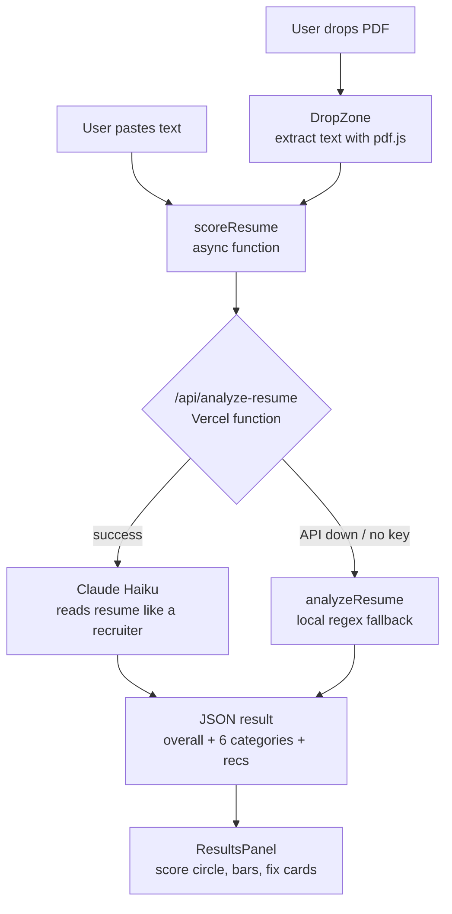

# Resume Review — How It Works

> A self-contained resume scoring tool bolted onto the accountability tracker. Drops a PDF → extracts text → Claude AI scores it → shows results. No backend database, no user accounts, no data stored anywhere.

---

## The Big Picture



---

## Files & What Each One Does

### `src/trackers/resume.js`
The entry ticket into the sidebar. Every tracker is a config object — this one has **no `columns` array** intentionally, which is the signal to App.jsx to skip the normal table pipeline.

```js
{ id: 'resume', name: 'Resume Review', icon: '📄', color: '#10b981' }
```

### `src/trackers/index.js`
Central registry. Just imports all tracker configs and exports them as a map. App.jsx reads this to build the sidebar and know which tracker is active.

### `src/App.jsx` — the escape hatch
Normally every tracker renders `StatsBar + TrackerTable`. The resume tracker needs a completely different UI, so there's a conditional branch:

```
activeId === 'resume'
  → render <ResumeReview />     ← custom UI, no table
  → else render StatsBar + TrackerTable  ← normal pipeline
```

This is the only place in the app where a tracker breaks out of the standard rendering pipeline.

---

## The Scoring Pipeline

### `api/analyze-resume.js` — the brain
A Vercel serverless function (lives server-side, never exposed to the browser). When called:

1. Validates the resume text (50+ words minimum)
2. Checks `ANTHROPIC_API_KEY` env var exists
3. Calls **Claude Haiku** with a detailed system prompt that explains:
   - The candidate profile (1yr post-grad SWE, AWS background)
   - Who they're competing against (L4/SWE2 at top companies)
   - Exact scoring rubric for all 6 categories
4. Returns structured JSON matching the result schema

> [!important] Why Claude instead of regex?
> Claude has seen millions of real resumes and job descriptions in training. It understands *context* — it knows "Reduced Lambda cold starts by 300ms" is a strong metric bullet, whereas a regex just looks for a number. It also stays current without code changes.

### `src/utils/resumeAnalyzer.js` — local fallback
Pure regex/keyword scorer used when the API isn't configured or fails. Same output shape as the Claude result so the UI doesn't know the difference. Scores 6 categories:

| Category | Weight | Method |
|---|---|---|
| Metrics & Impact | 25% | Regex: numbers + `%`, `ms`, `x`, `$`, `users` |
| Action Verbs | 15% | Keyword match against list of ~30 verbs |
| AWS Depth | 20% | Keyword match against ~30 service names |
| Tech Keywords | 15% | Keyword match against languages/frameworks |
| Structure | 10% | Looks for section headers in text |
| Length & Format | 15% | Word count thresholds (ideal: 350–600) |

---

## The UI Component Tree

```
ResumeReview              ← main export, owns result state + API call
├── InputPanel            ← shown when no result yet
│   ├── mode tabs         ← "Upload PDF" | "Paste Text" toggle
│   ├── DropZone          ← drag-drop area, calls pdf.js on drop
│   └── blueprint preview ← checklist of what we check for
└── ResultsPanel          ← shown after scoring
    ├── ScoreCircle       ← SVG arc, animates on mount
    ├── CatBar ×6         ← animated fill bars, staggered delays
    ├── rec cards         ← red left-border, only for failing categories
    ├── detected tags     ← orange=AWS, purple=tech stack
    └── blueprint list    ← same 10 items, with tips column
```

### `ResumeReview` (main)
Owns two pieces of state: `result` and `isAnalyzing`. Calls `scoreResume()` which tries the API first, falls back to local. Shows a loading screen during the Claude call (~1–2s).

### `InputPanel`
Two modes toggled by tabs. In upload mode it renders `DropZone`. In text mode it renders the monospace textarea. Both call the same `onAnalyze(text)` prop when ready.

### `DropZone`
Handles drag-over, drag-leave, drop, and click-to-browse. On file selection it calls `extractTextFromPdf(file)` — a loop over pdf.js pages that preserves line breaks by watching the y-position of each text item. The extracted string is plain text, same as if you'd pasted it.

### `ScoreCircle`
SVG with two `<circle>` elements — one static track, one animated arc. The arc's `strokeDashoffset` starts at the full circumference (276px) and transitions to `circ - (score/100)*circ` on mount. Score color: green ≥80, blue ≥60, amber ≥40, red below.

### `CatBar`
Each bar starts at 0 width and animates to `(score/10)*100%` after a staggered `setTimeout` delay (80ms × index). Color uses the same `scoreColor()` helper as the circle, but mapped from 0–10 → 0–100.

---

## Data Shape (the contract between API and UI)

Both the Claude API and the local fallback return this exact shape:

```json
{
  "overall": 72,
  "wordCount": 450,
  "source": "claude",
  "categories": [
    { "key": "metrics", "label": "Metrics & Impact", "score": 6, "weight": "25%" },
    { "key": "verbs",   "label": "Action Verbs",      "score": 9, "weight": "15%" },
    ...
  ],
  "recommendations": [
    { "category": "Metrics & Impact", "text": "Add numbers to every bullet..." }
  ],
  "highlights": {
    "awsServices": ["lambda", "dynamodb", "cloudwatch"],
    "techStack": ["python", "docker", "kubernetes"]
  }
}
```

`source` is added by `scoreResume()` in the frontend after the call resolves — `"claude"` or `"local"` — and drives the badge shown in the results header.

---

## CSS Structure

All resume styles live at the bottom of `src/index.css` under `/* ─── Resume Review ───── */`. Classes follow a flat BEM-ish naming: `.resume-*` for layout, `.pdf-*` for the drop zone, `.cat-bar-*` for score bars, `.detected-tag--aws` / `--tech` for the colored pills.

Responsive breakpoint at `900px`: two-column results grid collapses to single column, blueprint tips column hides.

---

## Environment Variable

`ANTHROPIC_API_KEY` lives in Vercel's encrypted environment — never in the codebase, never sent to the browser. The serverless function reads it from `process.env`. If missing, the function returns 503 and the frontend silently falls back to local scoring.
